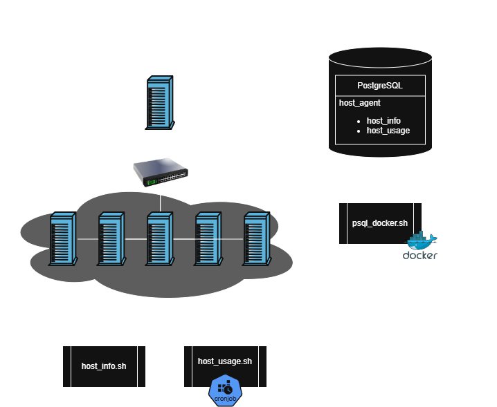

# Linux Cluster Monitoring Agent
The Linux Cluster Monitoring Agent is a Linux cron service designed to record the hardware specifications of a Rocky distro Linux cluster, internally connected by a switch and IPV4 addresses.
It will regularly monitor node resource usage (e.g. CPU, memory) in real-time (5min), and store the data into a Relational Database Management System (RDBMS) for ease of data access/manipulation.
The database is organized into two tables: `host_usage` and `host_info`, which records the node usage and hardware specification respectively.
The primary users are the Jarvis Linux Cluster Administration who wish to keep track of their Linux clusters, and want data to improve and monitor the cluster's health and load balance.
This project is made using PostgreSQL for the database, bash to run the shell scripts to retrieve usage and hardware data, and Docker to manage the PostgreSQL server. Git and Github were used to manage this project.

# Quick Start
This is how you will run both the scripts and database on the same machine.
Be sure to navigate into the `linux_sql` folder before running these commands.
- Start a psql instance using psql_docker.sh
```
    ./scripts/psql_docker.sh create host_agent password
```
- Create the database:
```POSTGRESQL
--- Connect to the psql instance
bash> psql -h localhost -U postgres -W

-- list all database
postgres=# \l

-- create a database
postgres=# CREATE DATABASE host_agent;
```
- Create tables using ddl.sql
```bash
    export PGPASSWORD=password
    psql -h localhost -U postgres -d host_agent -f sql/ddl.sql
```
- Insert hardware specs data into the DB using `host_info.sh`
```bash
    ./sql/ddl.sql start|stop|create [db_username] [db_password]
```
- Insert hardware usage data into the DB using `host_usage.sh`
```bash
    ./scripts/host_usage.sh localhost 5432 host_agent postgres password
```
- Crontab setup
```bash
    # Access the cron scheduler
    crontab -e
    # Then, update the path and place into the crontab to run `host_usage.sh` every 5 minutes:
    * * * * * bash /path/to/linux_sql/host_agent/scripts/host_usage.sh localhost 5432 host_agent postgres password > /tmp/host_usage.log
```

# Implementation
This project uses bash scripts to track hardware and machine usage, and Docker to run the PostgreSQL database.
In order to make sure all the data is tracked, the architecture dictates that one of the nodes in the cluster will host a Docker container that runs the PSQL database.
This database stores two tables that manage the hardware specifications and hardware usage reports.
The other nodes will be responsible for setting up the cronjob for `host_usage` and ran `host_info` once for identification.
The host node will be responsible for creating the database using `ddl.sql` to create the tables and running `psql_docker` to start.
As this is a closed system with a switch, it allows all nodes to use the same PSQL password without major fear of SQL injections.

So to summarize, a host will manage the PSQL database with docker, and through the closed system with a switch all nodes
will send their usage reports over to the host through a cronjob.

## Architecture


## Scripts
- psql_docker.sh
  - Create a psql Docker container, start an existing container, or stop an existing container.
```bash
./scripts/psql_docker.sh start|stop|create [db_username] [db_password]
```
- host_info.sh
  - Obtains the hardware specifications of the VM running the script and sends the data over to the database.
```bash
./scripts/host_info.sh [hostname] [port] [db_name] [db_username] [db_password]
```
- host_usage.sh
  - Obtains the usage data of the VM running the script and sends the data over to the database.
  - Usually run with a cronjob to regularly track the data.
```bash
./scripts/host_usage.sh [hostname] [port] [db_name] [db_username] [db_password]
```
- crontab
  - Access the cronjob scheduler.
```bash
    crontab -e
```

- queries.sql (describe what business problem you are trying to resolve)
- To be implemented.

## Database Modeling
- `host_info`
  | Field          | Description   |
  | :------------- | :------------- |
  | **id** | Unique database identifier for each machine. |
  | **hostname** | The VM's full hostname |
  | **cpu_number** | The number of CPUs available for the OS. |
  | **cpu_architecture** | The VM's CPU version... |
  | **cpu_model** | Cell 1, Row 2 |
  | **cpu_mhz** | The VM's CPU refresh rate in megahertz. |
  | **l2_cache** | The L2 Cache's storage size. |
  | **timestamp** | Timestamp of when this entry was made (YYYY-MM-DD HH:MM:SS) |
  | **total_mem** | The total RAM space on the VM in megabytes. |
- `host_usage`
  | Field          | Description   |
  | :------------- | :------------- |
  | **timestamp** | Timestamp of when this entry was made (YYYY-MM-DD HH:MM:SS) |
  | **host_id** | `host_info`'s id identifier. |
  | **memory_free** | The total amount of unused RAM space on the VM in megabytes. |
  | **cpu_idle** | The percentage amount of time that the CPU is idling. |
  | **cpu_kernel** | The percentage of time that the CPU is processing kernel operations. |
  | **disk_io** | The total number of Disk Input and Output operations. |
  | **disk_available** | The total available disk space on the VM. |


# Test
The testing for the bash script DDL was done with:
```bash
bash -x /path/to/linux_sql/scripts/[script_name].sh [arguments]
```
This command allows me to view the execution of my script step-by-step, and lets me see the output of every line.
If the final output does not match my expectations, or I see an error message or a non-zero exit code somewhere in the run, it lets me know there is something I need to address.
For instance, there was a point where the insert command was giving an error.
The command revealed it was related to the text values through bash. After some research, it became apparent that
the base replacement did not convert the variable values to a string literal, and made PSQL look for a variable instead,
leading to a failed insert, and the script ending with an error code 1.

# Deployment
The code is saved onto GitHub, and all nodes are required to pull the repo.
All nodes must run `host_info.sh` and have the crontab set up for `host_usage.sh`.
The node hosting the database must run `psql_docker.sh` to create and start the Docker container to run the database and `ddl.sql` to create the tables to store the incoming data.

# Improvements
- Automatically create the database and give drop/cleanup functionality
- Make a script to update the cronjob with a given frequency
- Save snapshots of the database and potentially allow rollback.
