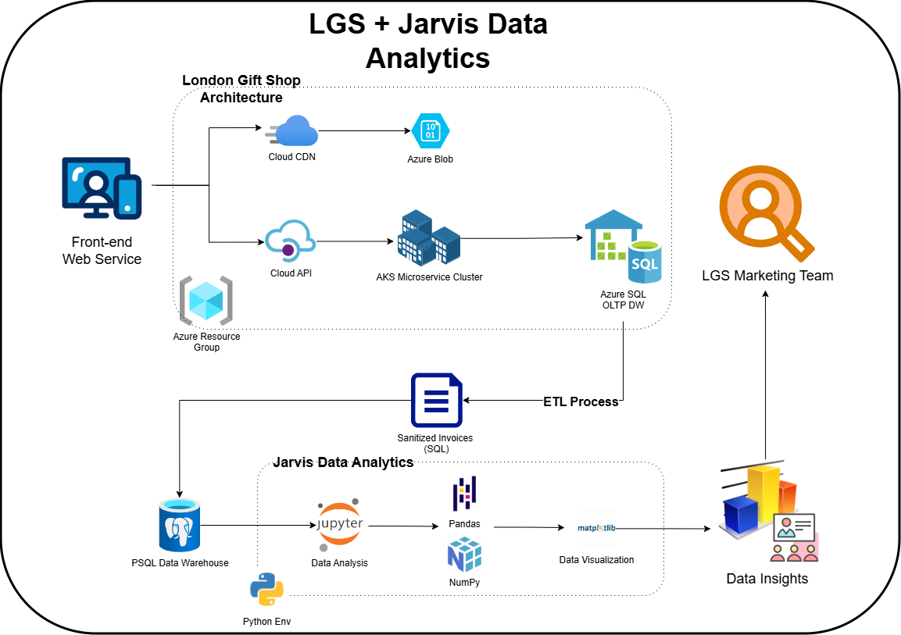

# Introduction
As a business analyst, the goal of this project is to analyze the London Gift Shop (LGS), and uncover potential ways to rebound from their stagnating growth.
LGS is primarily a UK-based online gift-shop retailer, with many of its clientele being wholesale retailers.
However, they have noticed that revenue has gone down, and they want to investigate why this is occurring.
To help their marketing team gain insight on their customers, the LGS IT team partnered with us at Jarvis to generate data for data analysis, with information about customer spending habits.
The LGS IT team performed an ETL workflow on their data warehouse to allow me to focus on the analysis itself.
They dumped and sanitized customer data from 01/12/2009 and 09/12/2011 into an SQL file, removing all personal data for safety and confidentiality.
On our end, I used Python, Jupyter Notebook, and Pandas to clean up the data, storing it into a PSQL database.
Docker was also used to containerize and manage the Jupyter Notebook and PSQL database.

I compiled all the data into a graphical format, highlighting and confirming their concerns of stagnating growth.
Though their revenue is still relatively steady, their growth in recent months have definitely stagnated, with a -0.6% monthly growth during December 2011.
From this insight, I performed a Recency, Frequency, Monetary (RFM) analysis and segmented their customer base based on when they made a purchase, how often they spent, and how much respectively.
From this analysis, I noticed that LGS had begun to accumulate customers who have begun to stop purchasing their products, despite being noticeable spenders.

# Implementation
## Project Architecture
The project required access from LGS' cloud-based data warehouse, storing data from their Azure Kubernetes cluster.
They use an OLTP Azure SQL database to store their transactional data, and take in new transactions via API calls.
The LGS team took customer data from this database, sanitized all customer personal data and sent an SQL file over, containing customer spending.
Our end then loaded this data into a PSQL database run on Docker and loaded the data into a Jupyter notebook for analysis using Pandas for calculations and Pyplot for visualizaton.
Once the analysis was complete, I compiled the data into a presentation and sent back a notebook for LGS' marketing team to use.

## Data Analytics and Wrangling
[Jupyter notebook](./retail_data_analytics_wrangling.ipynb)
- Discuss how would you use the data to help LGS to increase their revenue (e.g. design a new marketing strategy with data you provided)
  In my opinion, their biggest issue is that LGS is missing out on capturing interest on their infrequent customer base.
  I analyzed the data by obtaining each customer's RFM score based on percentile, and categorized them based on this RFM metrics.
  The main focus groups that caught my interest were the hibernating customers (infrequent spenders), Lost customers, and Potential loyal customers.

#### Hibernating Customers
The hibernating customers make 71 purchases, and spend £446 on average, and it means they could stand to gain from generating seasonal discounts or other incentives to get them to return.
With over 1000 of these customers, LGS should look to investigate why these customers aren't coming back.

#### Lost Customers
On the other hand, they are losing around £30 per lost customer, likely due to rebates, or cash returns.
with 481 customers they have lost, I advised that it might be best to investigate their customer service policies, and find out why these customers are still unhappy with their services.

#### Potential Loyal Customers
Finally, LGS is growing a large potential customer base, with over 600 customers averaging 71 purchases, spending £760 per customer.
This customer base is crucial to their future growth and improving their customer loyalty strategies should be their number one priority.
Of course, they should also look to retain their most loyal customers, so something to incentivize customer loyalty, like loyalty discounts and memberships were brought up during the meeting with them.

# Improvements
There were some improvements that I could've done to make the insights even better
1. Identify what factors their loyal spenders have, and identify how to retain this group.
2. Their company has peak and off-seasons. I could have spent time identifying customer churn to see why their off-season began so early.
3. LGS didn't provide categories for their products. I could have spent time categorizing and identifying their most popular and least popular products to streamline revenue streams.
